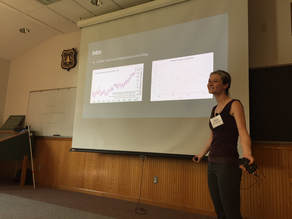
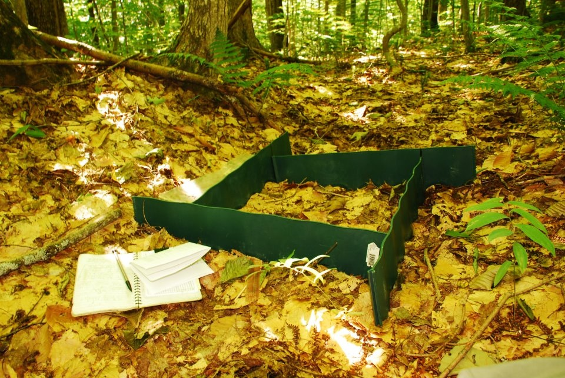

<h1> <u>Graduate Students</u> </h1>

</img>
<h4><b>Christian A. Burns</b></h4>
Plymouth State University 
external committee member 
Thesis: Breeding productivity and migratory connectivity in Canada Warblers (<i>Cardellina canadensis</i>) in central New Hampshire

 

<h1> <u>Undergraduate Students & Independent Projects</u> </h1>

<b>Kim Savides</b> SUNY - ESF '16 
Independent project</b>

<b>Aimee Van Tatenhove</b> Cornell University '14 
Independent project

<b>Emily Filiberti</b> University of New England '17 
Independent project

<b>Caitlin N. Wildes</b> University of Florida '11 
NSF-REU</b>

<b>Joseph F. Welklin</b> Indiana University '12 
NSF-REU

<b>C. Logan Bryant</b> Frostburg State University '13 
NSF-REU

<a href="https://aprilcosta.wordpress.com/2013/05/10/a-memory/" target="_blank;">Combining science and art</a> - check out this ovenbird piece by a very talented field technician of mine - April Costa
