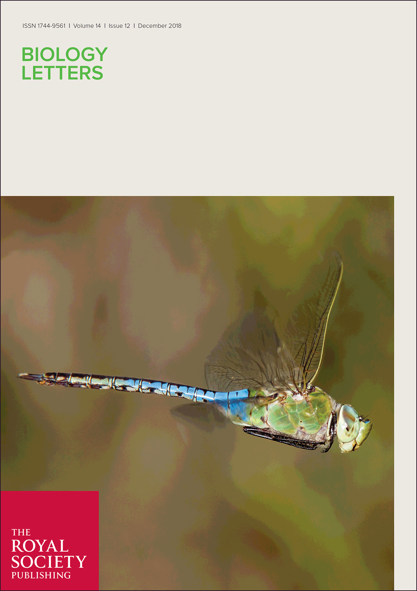
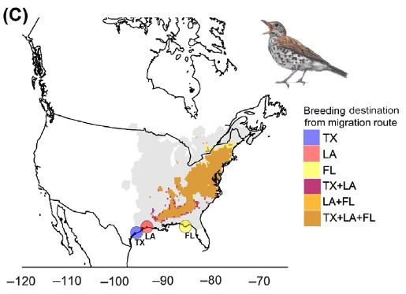
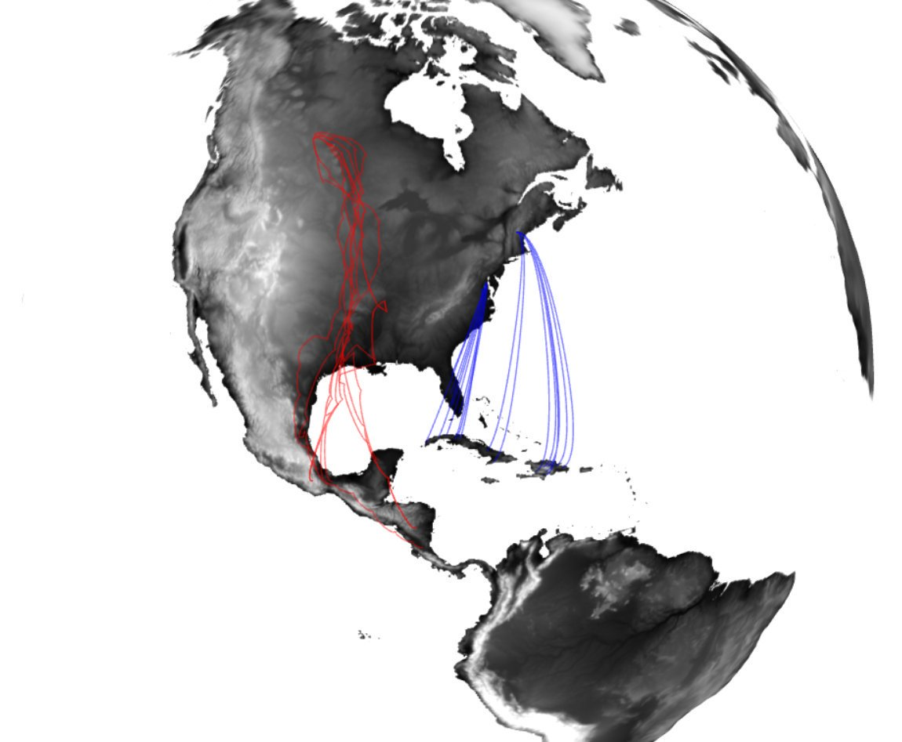
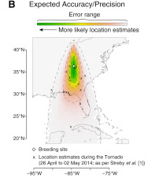
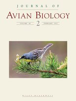
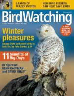
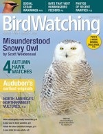

`r paste0("Last updated: ",file.mtime("news.Rmd"))`

<h1> 2019 </h1>

<h1> 2018 </h1>

New paper in <i>Biology Letters</i> describes the annual cycle of a long-distance migratory insect - the Common Green Darner. 
Media coverage: 
<a href="https://www.washingtonpost.com/science/2018/12/21/theres-huge-hidden-migration-america-dragonflies/?noredirect=on&utm_term=.a50553f19b15" target="_blank">The Washington Post</a> 
<a href="https://www.sciencenews.org/article/green-darner-dragonflies-migrate-bit-monarch-butterflies" target="_blank">ScienceNews</a> 
<a href="https://www.smithsonianmag.com/smart-news/dragonfly-undertakes-epic-multi-generational-migration-each-year-180971190/" target="blank">Smithsonain.com</a> 
<a href="https://www.atlasobscura.com/articles/do-dragonflies-migrate" target="_blank">Atlas Obscura</a> 
<a href="https://www.mnn.com/earth-matters/animals/blogs/it-takes-this-dragonfly-three-generations-to-complete-annual-migration" target="_blank">MNN Earth Matters</a> 
<a href="https://news.theceomagazine.com/news/scientists-have-discovered-green-darner-dragonflies-take-three-generations-to-complete-migration/" target="_blank">CEO magazine</a> 
<a href="https://canadianhomesteading.ca/science/dragonflys-migration-is-no-mystery-for-scientists-anymore/7915" target="blank">Canadian Homesteading</a> 

We developed a new method to estimate the strength of migratory connectivity using stable hydrogen isotopes in feathers! We've updated the MigConnectivity R package to include this exciting new tool. 

New <i>Methods in Ecology & Evolution</i> paper out detailing a method for quantifying migratory connectivity. 

Media coverage: 
<a href="https://nationalzoo.si.edu/migratory-birds/news/smithsonian-scientists-develop-free-tool-improve-understanding-migratory" target="_blank">Smithsonian's National Zoo & Conservation Biology Institute</a> 
<a href="https://methodsblog.wordpress.com/2017/11/21/strength-of-migratory-connectivity/" target="_blank">Methods in Ecology & Evolution Blog #1</a> 
<a href="https://methodsblog.wordpress.com/2017/11/09/migratory-connectivity/" target="_blank">Methods in Ecology & Evolution Blog #2</a> 

 

A cautionary tale: inherent limits of light-level geolocation may lead to over-interpretation. Our response  to a previously published study was published in Current Biology. The original study inferred songbirds traveled large distances to avoid tornados. We clearly show those 'movements' fall well within location uncertainty associated with light-level geolocation.

<h1> 2017 </h1>

Manuscript using light-level geolocators to identify non-breeding locations, migration routes and timing of Kirtland's Warblers gets the cover of Journal of Avian Biology

 

Our recent Journal of Avian Biology paper was featured in BirdWatching Magazine - read the article <a href="https://www.birdwatchingdaily.com/news/science/geolocators-reveal-loop-migration-kirtlands-warbler/" target="_blank";>here</a>

 

<h1> 2015 </h1>

Our recent <i>Scientific Reports</i> paper demonstrating the use of miniaturized GPS tags to track Ovenbirds from breeding to non-breeding territories was featured by several popular media outlets.

Click the links below to read the articles - 
<a href="http://www.birdwatchingdaily.com/blog/2015/08/12/tiny-gps-tags-are-huge-for-the-study-of-small-birds/" target="_blank">BirdWatching</a> 
<a href="http://motherboard.vice.com/read/tracking-tiny-birds-using-tiny-gps-backpacks" target="_blank">Motherboard</a> 
<a href="http://www.smithsonianmag.com/smithsonian-institution/hottest-new-accessory-songbirds-tiny-gps-enabled-backpacks-180955625/" target="_blank">Smithsonian Magazine</a>

 

