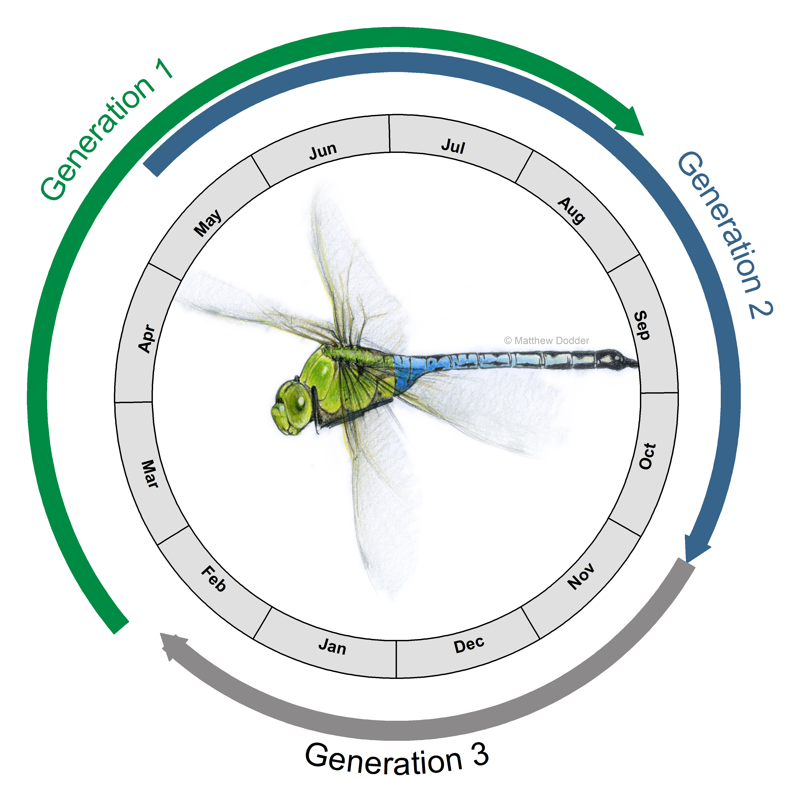
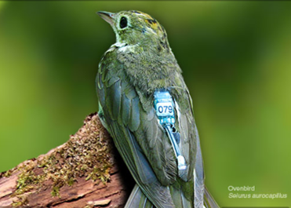
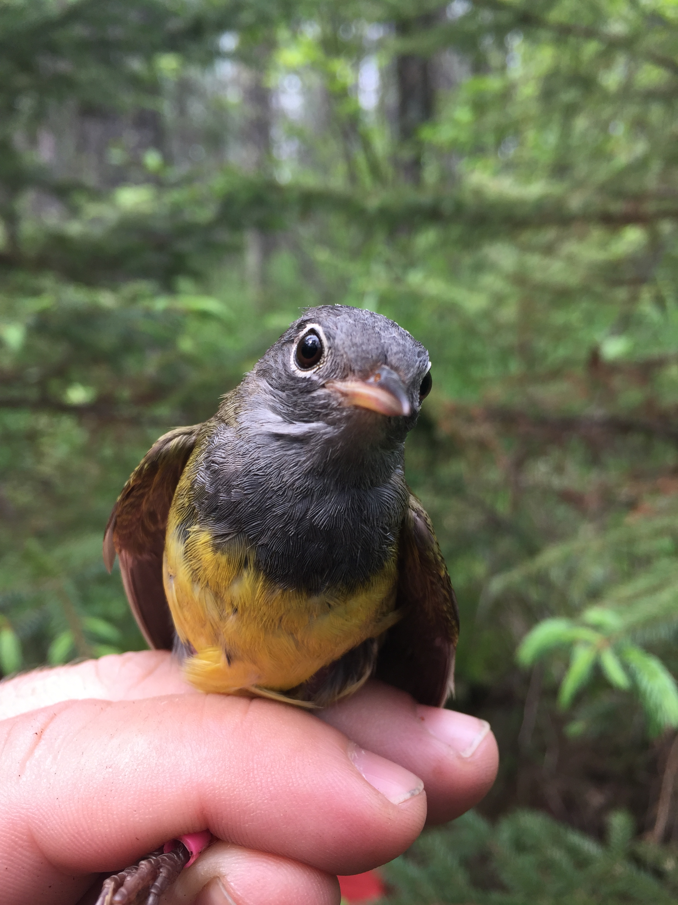

Last updated: 2019-09-06

<h4><i>Currently under construction</i></h4>

I am an ecologist that uses a full annual cycle approach to understand the interplay between the environment and population demography. To do this, I integrate animal movement at multiple spatial scales - from fine scale habitat selection of individuals to intercontinental migrations of populations. Identifying how different phases of the annual cycle interact to shape individual-, population- and community dynamics, is essential to understand how they respond to global change. 

The overarching goals of my research program are to:

<ol>
<li>Reveal the mechanisms that drive behavior, life-history and demographics of wildlife populations</li>
<li>Identify where migratory individuals and populations are throughout the year to better inform conservation</li>
<li>Determine when and where wildlife populations are limited</li>
</ol>

<h1><u>Research projects</u> </h1>

 <b>Full Annual Cycle</b>

 <b>Migratory Connecitivity</b>

 <b>Conservation</b>

